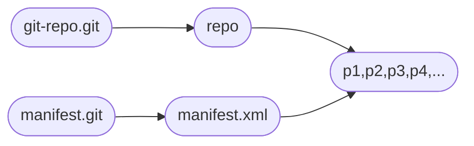

# arch



# INSTALL

```bash
## download repo tool and upload to git-server
$ git clone https://gerrit.googlesource.com/git-repo
$ mkdir ~/bin/
$ cp git-repo/repo ~/bin/
## create a manifest repository
$ touch default.xml
$ git add default.xml && git commit -m "init" && git push
```

# manifest

```xml
<?xml version="1.0" encoding="UTF-8"?>
<manifest>
  <remote name="gitlab"
      fetch="ssh://git@xxx.com/public"/>
  <default revision="master"
           remote="gitlab"
           sync-j="2" />
  <project path="project1" name="project1" />
	<project path="project2" name="project2" />
</manifest>
```

# usage

```bash
## init local repo
$ repo init -u your-manifest-git-url --repo-url=your-repo-git-url -m daily.xml
## download code
$ repo sync -j 2
## generate a manifest xml file for a snapshot
$ repo manifest -r -o daily.xml
## run a command for each repo
$ repo foreach -c git status
```

